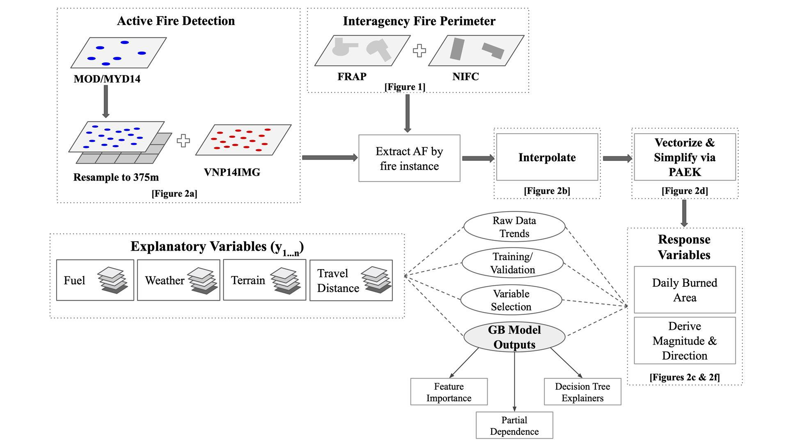
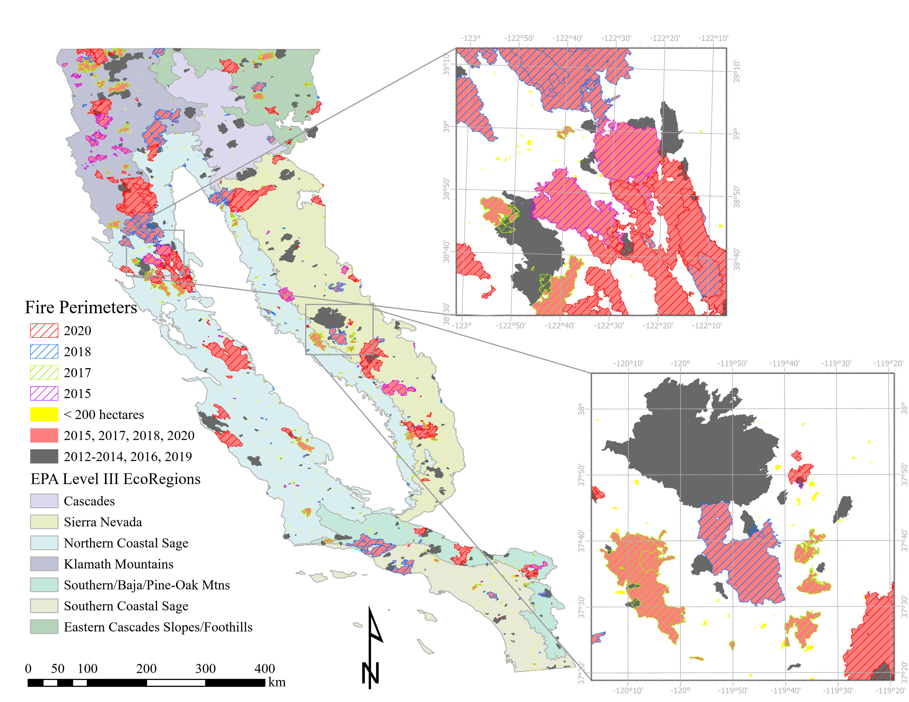
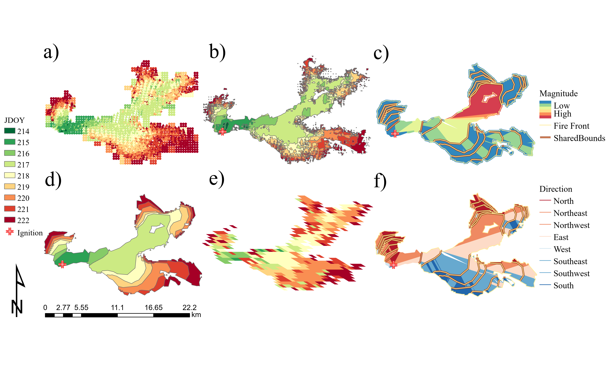
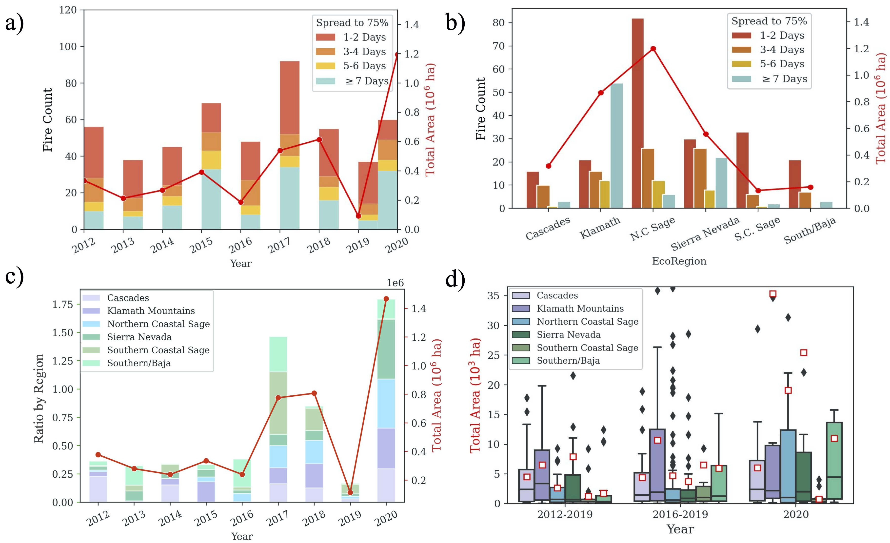
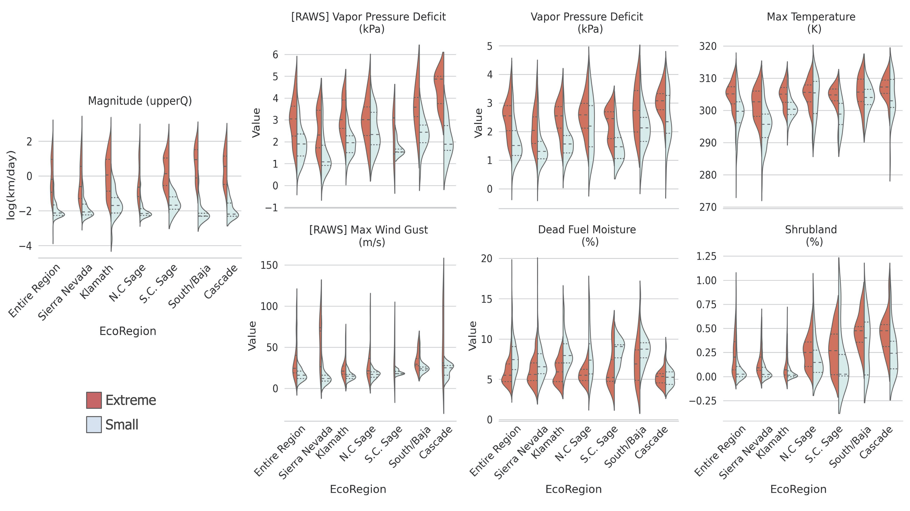
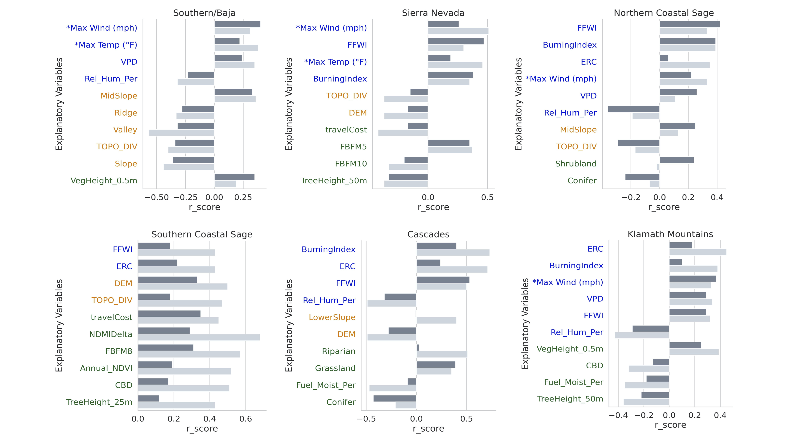
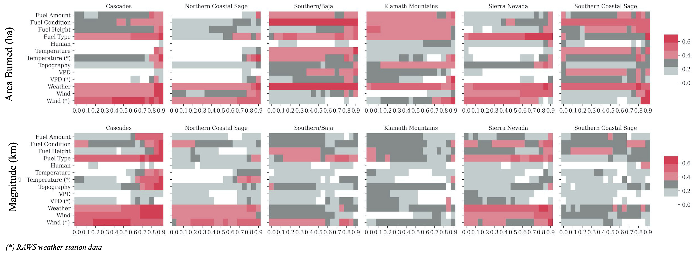
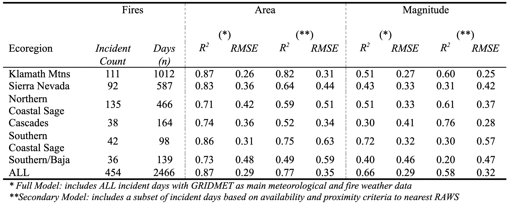
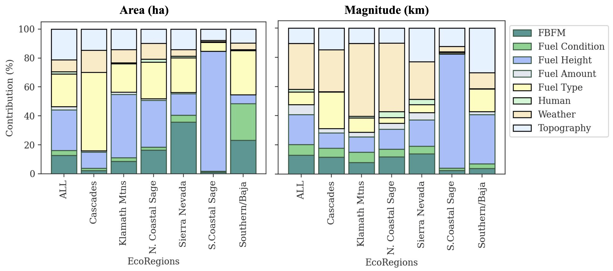
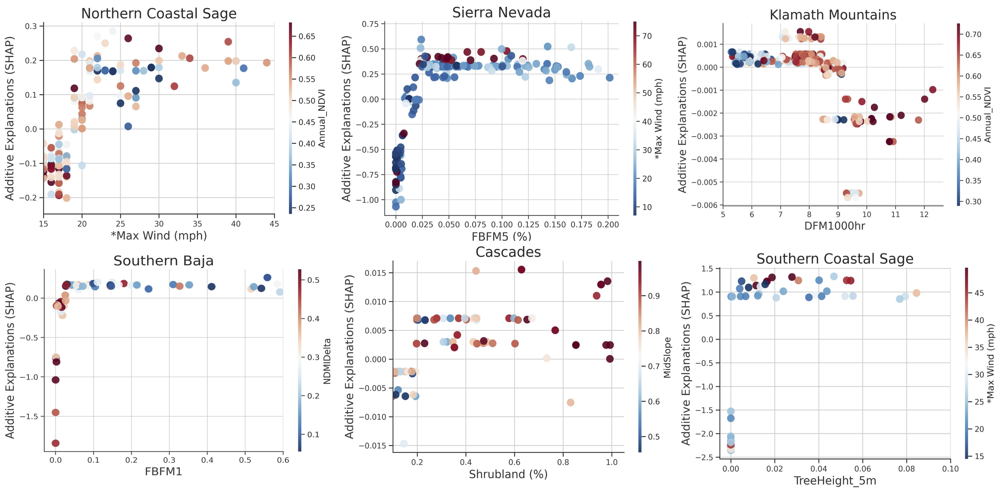

# A Comprehensive Guide to: <u>Understanding Fire Driver’s Across California’s Diverse Ecoregions</u>

## Table of Contents  
- [Project Description](#project-Description)  
- [Introduction](#introduction)  
- [Primary Packages](#primary-packages)  
- [Study Region](#study-region) 
- [Methods](#methods)  
- [Key Findings](#key-findings) 

## Project Description
Wildland fires at varying intensities and frequencies are a critical ecological process across the western United States. Variability in fire behavior is heavily influenced by dynamic and often complex interactions between meteorological and biophysical components.
 
We here used a machine learning approach to investigate what factors caused the rapid spread of large wildfires in the recent decade, across six distinct ecoregions in California. Continuous daily fire spread and area burned were derived from MODIS and VIIRS active fire products.
 
The results from this study seek to provide insights on the efficacy of fuel management on reducing the rate of fire progression across ecologically diverse regions and help communities and managers to better anticipate and mitigate future risk of fast moving wildfires in the coming decades.

---

## Introduction
This documentation is meant to serve as a guide to execute the central workflow of the project (fig. 1).
Six primary iPython notebooks (.ipynb) files are made available in the Scripts folder to run consecutively. We recommend using Google Colab, which is a Python development environment that allows you to run Jupyter notebooks in the browser i.e. so you don’t have to locally. When running the scripts using Google’s Colab notebook, each step has pre-existing set-up
lines to enable a smooth runtime. Although unlikely, to prevent any overloading and crashes when using [Colab Pro](https://colab.research.google.com/notebooks/pro.ipynb) be sure to access the high-memory runtime whenever possible. 

<b>Complete step-by-step 'how to' overview can be found [here](./howto.pdf)</b>

<figure class="image">
  
  <figcaption>Figure 1. High level diagram outlining modeling framework</figcaption>
</figure>

## Primary packages 

I. Setting up
* Colab: [What is Colaboratory](https://colab.research.google.com/notebooks/intro.ipynb)
* Earth Engine Python API: [Python Installation | Google Earth Engine](https://developers.google.com/earth-engine/guides/python_install)

II. Data & Spatial Processing
* Geopandas: [GeoPandas 0.8.0 — GeoPandas 0.8.0 documentation](https://geopandas.org/)
* Shapely: [Shapely · PyPI](https://pypi.org/project/Shapely/)
* NumPy: [NumPy.org](https://numpy.org/)
* Rtree: [Rtree · PyPI](https://pypi.org/project/Rtree/)
* GDAL: [GDAL — GDAL documentation](https://gdal.org/)

III. Visualization
* Matplotlib: [Matplotlib: Python plotting — Matplotlib 3.3.3 documentation](https://matplotlib.org/)
* Seaborn: [seaborn: statistical data visualization — seaborn 0.11.1 documentation](https://seaborn.pydata.org/index.html)
* Folium: [Folium — Folium 0.12.1 documentation](https://python-visualization.github.io/folium/)

IV. Modeling
* Sklearn: [scikit-learn: machine learning in Python — scikit-learn 0.24.1
documentation](https://scikit-learn.org/stable/)
* SHAP: [Welcome to the SHAP documentation — SHAP latest documentation](https://shap.readthedocs.io/en/latest/)

## Study Region 
This study examined fires larger than 200 hectares (~500 acres) from January 1, 2012 to September 15, 2020 across California encompassing seven Level-III ecoregions. 

<figure class="image">
  
  <figcaption>Figure 2. Fire perimeters in the entire study region, overlaid on top of EPA level III ecoregions. High risk years (2015, 2017, 2018, 2020) highlighted with multi-colored hash marks. </figcaption>
</figure>

## Methods 

To characterize fire spread, we derived daily fire perimeters by spatialy interpolating MODIS and VIIRS active fire products from the Fire Information for Resource Management System (FIRMS) 

Derived perimeters were used to calculate daily burned area, magnitude, and direction of fire spread. 

Gradient boosting (GB) machine learning algorithm was used for the prediction of daily burned areas and magnitude for the fires in the study region. 

<figure class="image">
  
  <figcaption>Figure 3. Example of 2018 Donnell fire showing high-level workflow; a) active fire points (resampled 375m MOD/MYD14 & VNP14IMG), b) original interpolation product and d) simplified-derived perimeters compared alongside e) Suomi 500m VIIRS burned area product (VNP64A1). Fire spread attributed c) magnitude and f) direction. </figcaption>
</figure>

## Data Layers
To delineate fuel, topography, fire weather, and human-influence components, 23 variables were chosen as inputs into the model. 

Data sources include: 
* Fire Information for Resource Management System ([FIRMS](https://firms.modaps.eosdis.nasa.gov/download/)) 
* Fire and Resource Assessment Program [(FRAP](https://frap.fire.ca.gov/))
* National interagency Fire Center ([NIFC](https://www.nifc.gov/fireInfo/fireInfo_main.html)) databases 
* Fuel type & height ([Landfire](http://landfire.gov/))
* Daily gridded weather data ([gridMET](http://www.climatologylab.org/gridmet.html)) 
* Remote Automated Weather Stations ([RAWS](https://raws.dri.edu/))

# Key Findings 

## Temporal and Regional Fire Occurences Across California 

* Higher rates of forward-moving fires, at larger values of magnitude, but smaller cumulative areas, move quickly for shorter time spans and are predominantly located in fuel-limited area (Table I). 
* In comparison, montane regions typically saw larger fires with slower rates of spread, burning for longer periods of time (Table I). 

<figure class="image">
  
  <figcaption>Figure 4. Days to reach at least 75% of cumulative area burned for fires greater than 200 ha (~500 acres)  based on (a) years  2012 to 2020 and (b) region with total area (red line). c) Time-series of total annual burned area (red line) and regional ratio (area burned / 9 yr total area). d) Comparison between area burned for each fire instance grouped in 4 year intervals with 2020 by ecoregion. Average fire sizes are shown by the red boxes. Note: 2020 fires are up until Sept 15, 2020. </figcaption>
</figure>

<figure class="image">
  
  <figcaption>Table I. Summary statistics of fire spread rate in km day-1 for fires greater than 500 acres in California.
 </figcaption>
</figure>

## Differences in weather and fuel on fast and slow moving fire days 

* Extreme, high-spread risk conditions are often linked to fuelscapes with shorter vegetation indicative of shrub- and/or grasslands, during periods of high vapor pressure deficit (vpd), temperature, and intense wind gusts (Fig. 5). 

<figure class="image">
  
  <figcaption> Figure 5. Comparison of value distribution between extreme fire spread (> 75 percentile) and small burns (< 25 percentile) for variables including: vapor pressure deficit, max temperature, dead fuel moisture, and percent shrubland for full dataset grouped by ecoregion. Weather station values are also reflected for VPD and maximum wind speed with a subset of data. </figcaption>
</figure>

## Regional differences in univariate correlation with fire spread 

* Northern CA regions were more sensitive to temperature-related fire weather indicators (Fig. 6). 
* On the other hand, fuel-limited areas, particularly the Southern Coastal Sage region, had stronger correlation with fuel and moisture-level related variables such as annual NDVI and canopy bulk density (CBD) (Fig. 6). 

<figure class="image">
  
  <figcaption> Figure 6. Top ten variables indicating fuel (green), weather (blue), topography (orange) with strongest Pearson's correlation coefficient (r) between area burned (dark gray) and fire spread (light gray) based on ecoregion.</figcaption>
</figure>

<figure class="image">
  
  <figcaption> Figure 7. Strength of relationship between area burned and magnitude of spread with variable type (i.e. topographic, fuel, and wind) based on size of burn grouped by quantile intervals. Patterns arise as greater correlation between fires with rapid spread are observed with wind velocity (mph), temperature, and vapor pressure deficit for subset of large burn days notably for the Cascades, and Southern/Baja ecoregions.</figcaption>
</figure>

## Model performance 

* The gradient boosting machine learning model explained 87% of variability in area burned and 66% of variability in the magnitude of spread at the daily time scale (Table II). 
* Across ecoregions, Klamath Mountain ecoregion performed the best overall with R2 of 0.87 and RMSE of 0.26, followed by Southern Coastal Sage and Sierra Nevada regions. 

<figure class="image">
  
  <figcaption> Table II. Model performance for each ecoregion for full and secondary models.</figcaption>
</figure>

## Variable contribution to fire spread 

* Area burned was observed to be more driven by biophysical attributes, such as fuel type and height. 
* Magnitude of spread was influenced more so by weather factors such as wind speed (Fig. 8). 

<figure class="image">
  
  <figcaption> Figure 8. Relative (%) contribution from explanatory variables based on permutation importance for full gradient boosting model based on type (i.e. Fuel, Topography, Weather, Human) for each response (a) Area (ha), (b) Magnitude (m). The stacked areas represent the cumulative percentage of gain explained in the model for each category and region.</figcaption>
</figure>

## Effects of key predictors on fire activity 

* Heightened fire spread was further exacerbated mainly between certain combinations of meterological and biophysical conditions. 
* For example, Sierra Nevada region observed greater sensitivity towards areas with higher proportion of FBFM 5 and/or FBFM 4 vegetation (attributed to shrublands), further magnified during periods of intensified wind events. 

<figure class="image">
  
  <figcaption> Figure 9. SHAP feature dependence plots for fire spread model for selected variables for each ecoregion plotted with interactions (hue) where red is high and blue is low values.
</figcaption>
</figure>